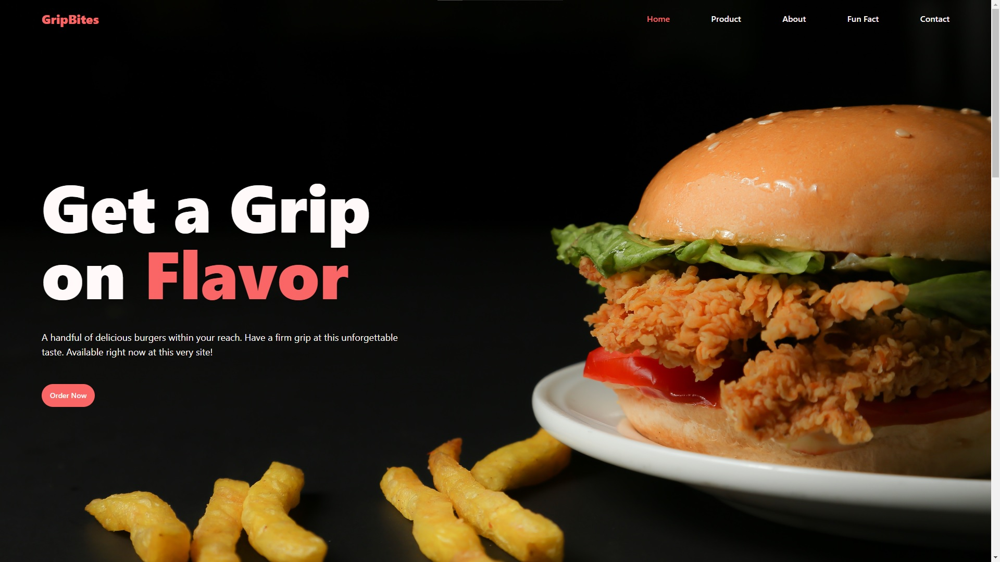
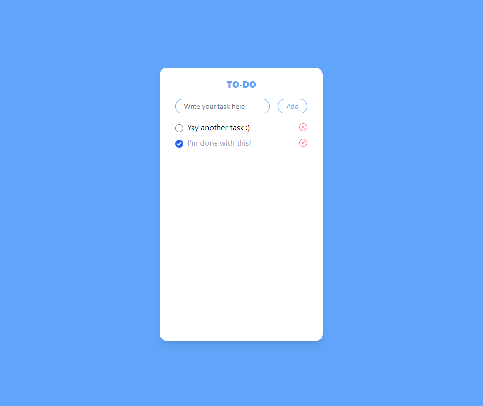

# Junior Front End Assessment

This is an assessment to measure my capability as a Front End Developer. This is a **48-hour** assessment which includes two Tasks.

## [Task 1](https://github.com/AlecBlance/Junior-FE-Assessment/tree/main/Task1)

has a set of instructions, and design to follow. I was given the creative freedom to showcase any product. It should also be responsive, and with good aesthetics.

## [Task 2](https://github.com/AlecBlance/Junior-FE-Assessment/tree/main/Task2)

a To-Do list which has all the basic functions such as add, delete, complete.

### Technologies used

- **React** - I used this Javascript library to easily create and manage UI components and states. It also supports other libraries which is a handy arsenal for building a Single Page Application
- **Tailwind** - This is a CSS library which has a set of predefined classes. I used this for simplicity, and responsiveness.
- **Vite** - A simple lightweight local development server which includes templates for React. It has Hot Module Replacement ​ which instantly shows UI updates without reloading the web page.
- **NPM** - A package manager I used for install libraries mentioned above.

### Installation

1. Install NPM by following the [installation instructions](https://docs.npmjs.com/downloading-and-installing-node-js-and-npm) of your OS.
2. Simply clone or download this repository
3. Open your favorite terminal, and navigate to the repository's folder
4. Still using the terminal, open any Task folder you want to see.
5. Inside the folder, run `npm install`
   _This will install all the dependencies of the Task you opened_
6. Next `npm run build` to compile the project to production
7. Lastly run `npm run preview`.
   _It will show the "local" address which you will access using the browser._

Note: To terminate the program, open the terminal and click _Ctrl+C_ or _Ctrl+Z_
You can repeat the steps 4-7 for any of the Task.
